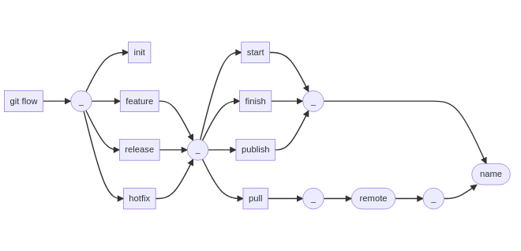

## Instalación

| Comando                         | Sistema Operativo   |
| ------------------------------- | ------------------- |
| `yay -S gitflow-avh`            | Archlinux o Manjaro |
| `sudo apt-get install git-flow` | Ubunto o Debian     |
| `sudo dnf install gitflow`      | Fedora              |
| `brew install git-flow`         | Mac OS X            |

Otros ejemplos de [Instalación](https://github.com/nvie/gitflow/wiki/Installation).

## Inicializar Git Flow

```shell
$ git flow init [-fd]
```

Inicializar un repositorio de *git* existente para usar [git flow](https://danielkummer.github.io/git-flow-cheatsheet/).

- `-d` Usar nombres de ramas predeterminados
- `-f` Forzar

## Trabajar una funcionalidad (feature)

```shell
$ git flow feature [list] [-v]
```

Listar las funcionalidades existentes.

- `-v` Salida (más) detallada

```shell
$ git flow feature start [-F] <name> [<base>]
```

Empezar a desarrollar una nueva funcionalidad llamada *name*. Crea una nueva rama basada en *develop*, opcionalmente se puede crear basada en *base*.

- `-F` *fetch* desde *$ORIGIN* antes de realizar la operación localmente

```shell
$ git flow feature finish [-rFkDS] <name|nameprefix>
```

Finalizar el desarrollo de la funcionalidad *name*, la rama *name* se fusiona en *develop*, se elimina la rama *name* y cambia hacia la rama *develop*.

- `-r` *rebase* en lugar de *merge*
- `-F` *fetch* desde *$ORIGIN* antes de finalizar
- `-k` Mantener la rama *name* después de finalizar
- `-D` Forzar la eliminación de la rama después de finalizar 
- `-S` Realizar *squash* en el *merge*

```shell
$ git flow feature publish <name>
```

Publicar la funcionalidad *name* en el *$ORIGIN* para que otros también puedan trabajar en ella.

```shell
$ git flow feature pull <remote> [<name>]
```

Obtener la funcionalidad *name* publicada en *remote*.

```shell
$ git flow feature track <name>
```

Seguir la funcionalidad *name* desde *$ORIGIN*. 

```shell
$ git flow feature diff [<name|nameprefix>]
```

Mostrar todos los cambios en *name* que no están en *develop*.

```shell
$ git flow feature rebase [-i] [<name|nameprefix>]
```

Realizar *rebase* de *name* en *develop*.

- `-i` Realizar un *rebase* interactivo

```shell
$ git flow feature checkout [<name|nameprefix>]
```

Cambiar a la rama *name*.

## Hacer un lanzamiento (release)

```shell
$ git flow release [list] [-v]
```

Listar los lanzamientos existentes.

- `-v` Salida (más) detallada

```shell
$ git flow release start [-F] <version>
```

Iniciar una nueva rama de lanzamiento llamada *version*. Crea una nueva rama basada en *develop*. 

- `-F` *fetch* desde *$ORIGIN* antes de realizar la operación localmente

```shell
$ git flow release publish <name>
```

Publicar el lanzamiento *name* en el *$ORIGIN* para que otros puedan verla.

```shell
$ git flow release finish [-Fsumpkn] <version>
```

Terminar el desarrollo del lanzamiento *version*, la rama *version* se fusiona en *master*, se crea un *tag* en *master* llamado *version*, el *master* se fusiona en *develop* y se elimina la rama *version*, finalmente cambia hacia la rama *develop*.

- `-F` *fetch* desde *$ORIGIN* antes de finalizar
- `-s` Firmar la etiqueta *version* criptográficamente
- `-u` Usar la clave GPG dada para la firma digital (implica `-s`)
- `-m` Usar el mensaje de etiqueta dado
- `-p` *push* a *$ORIGIN* después de finalizar
- `-k` Mantener la rama *version* después de finalizar
- `-n` No etiquetar este lanzamiento

```shell
$ git flow release track <name>
```

Seguir el lanzamiento *name* desde *$ORIGIN*. 

## Corregir incidencias (hotfix)

```shell
$ git flow hotfix [list] [-v]
```

Listar las incidencias existentes.

- `-v` Salida (más) detallada

```shell
$ git flow hotfix start [-F] <version> [<base>]
```

Iniciar una nueva rama de incidencia llamada *version*. Crea una nueva rama basada en *master*, opcionalmente se puede crear basada en *base*.

- `-F` *fetch* desde *$ORIGIN* antes de realizar la operación localmente

```shell
$ git flow hotfix finish [-Fsumpkn] <version>
```

Terminar la incidencia *version*, la rama *version* se fusiona en *develop* y *master*, se crea un *tag* en *master* llamado *version*.

- `-F` *fetch* desde *$ORIGIN* antes de finalizar
- `-s` Firmar la etiqueta *version* criptográficamente
- `-u` Usar la clave GPG dada para la firma digital (implica `-s`)
- `-m` Usar el mensaje de etiqueta dado
- `-p` *push* a *$ORIGIN* después de finalizar
- `-k` Mantener la rama *version* después de finalizar
- `-n` No etiquetar este lanzamiento

## Resumen de Comandos



